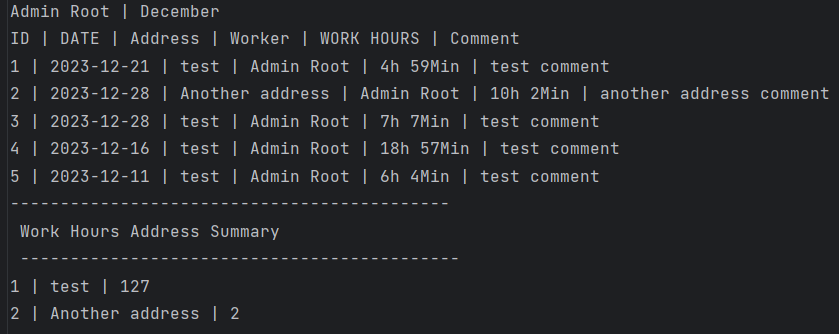

<h1 align="center" style="font-size:40px" >WorkApp</h1>

## [1. About the application](#About)
## [2. System requirements](#requirements)
## [3. Instalation and lunching](#insalation)
## [4. File structure](#structure)
## [5. Application functionality](#functionality)
## [6. Database integration](#database)
## [7. Security](#security)
## [8. Conclusion](#conclusion)

<h2 id="About">1. About the application</h2>

The application was created for companiens that needs to menage employees and the workplaces in which currently work. Thanks to this application, the employee can easily record his working hours at a given address and the employer has easy control over the emplyees and their work. 
 
The program was written in the Java programming language using the JavaFX framework to create user interface. This project was created using the dependency management tool, Maven, which allowed for easier library management and project building. Additionaly the project uses a MySQL database to store informations about employees and their working hours. The application allows to login to the main panel where, depending on user's permissions, he has access to various functions. The employee has access to to functions such as:
<ul>
	<li> Panel with personal data, where the user can check his data 
	</li>
	<li>A panel with working hours, where the user can view saved working hours or add new ones by selecting a date in the calendar
	</li>  
	<li> Password change pannel where the user can change the password for his account
	</li>
	<li>Earnings panel, where the user selecting a given month, will receive information about the number of hours worked and the amount of gross remuneration he will receive for the hours worked.
	</li>
</ul>
There are also two additional panels that can only be seen by a user with "admin" permision:
<ul>
	<li>Panel with employees, where you can view list of all employees, change their data, generate a report of hours worked in a given month and add new employees. 
	</li>
	<li>Panel with addresses, where you can view addresses of workplaces, generate a report for a given month or add new address.
	</li>
</ul>

<h2 id="requirements">2. System requirements</h2>

<ul>
<li> Java: 20.0.1  </li>
<li> Maven compiler: 3.11.0  </li>
<li> MySQL: 8.2.0  </li>
<li> Javafx-maven-plugin: 0.0.8  </li>
</ul>

<h2 id="insalation">3. Instalation and lunching</h2>
<ul>
<li>

Before start program is needed create database and import data to it. To do this open terminal and create database using this command <i style="background-color:#262626; padding:1px 10px">mysql -u 'user_name' -p -e "CREATE DATABASE persons;</i> 
You will be prompted to enter the password. The password is: <i style="background-color:#262626; padding:1px 10px">1234qwer</i>.
 
Where <i>user_name</i> is name of computer user and <i>persons</i> is name of database (It can be change becase the same name is implemented in code) 
</li>

<li>
Next what is needed is to import data from file to created database. To do this in terminal use this command <i style="background-color:#262626; padding:1px 10px"> mysql -u 'user_name' -p persons < dump.sql </i>
 
Where <i>user_name</i> is name of computer use (like abow) <i>persons</i> is created database and <i>dump.sql</i> is file with data. The file is included in application files in MySqlFiles folder (if you are in the same path in terminal as dump.sql file then you must provide the full path to the file).
 
After that you have database with every important data to start using application.
</li>
 
<li>
Now you can open IDE (for example IntelliJ), open project, comile and run it. 
</li>
</ul>

<h2 id="structure">4. File structure</h2>

The programm consist of 14 classes

<ol>
	<li>
	AddNewAddress
		<ul>	
			<li>AddNewAddress(int id, String address, boolean active)</li>
			<li> getID() </li>
			<li> getAddress() </li>
			<li> getActive() </li>
			<li> setActive(boolean act) </li>
		</ul>
	</li>
	<li>
	AddNewWorker
		<ul>
			<li> createNewWorker() </li>
		</ul>
	</li>
	<li>
	AddWorkTime
		<ul>
			<li> AddWorkTime() </li>
			<li> initialize(URL arg0, ResourceBundle arg1) </li>
			<li> ActiveAddressList() </li>
			<li> addressList() </li>
			<li> setMainPanelController(MainPanel mainPanel) </li>
			<li> submitButton() </li>
		</ul>
	</li>
	<li>
	DatabaseConnector
		<ul>
			<li> DatabaseConnector() </li>
			<li> executeQuery(String query) </li>
			<li> close() </li>
		</ul>	
	</li>
	<li>
	EditWorkTime
		<ul>
			<li> initialize(URL arg0, ResourceBundle arg1) </li>
			<li> setData(int startH, int startM, int endH, int endM, String address, String comm) </li>
			<li> addressList() </li>
			<li> addNewWorkTime() </li>
			<li> deleteWorkTime() </li>
			<li> setMainPanel(MainPanel mainPanel) </li>
			<li> editWorkTimeData() </li>
		</ul>
	</li>
	<li>
	LoadPersonData
		<ul>
			<li> dbConnection() </li>
			<li> logInToApp(String userLogin, String userPassword, Text textError) </li>
			<li> changePassword(String pass, int id) </li>
		</ul>
	</li>
	<li>
	LoadWorkTimeData
		<ul>
			<li> dbConnection(int userID, LocalDate data) </li>
			<li> getDataFromWorkTime(int userID) </li>
		</ul>
	</li>
	<li>
	LoginPanelController
		<ul>
			<li> getMd5( String source ) </li>
			<li> getString( byte[] bytes ) </li>
			<li> getPersonData() </li>
			<li> logIn() </li>
		</ul>
	</li>
	<li>
	MainPanel
		<ul>
			<li> MainPanel() </li>
			<li> createMainPanel() </li>
			<li> getScene() </li>
			<li> showAdminTest() </li>
			<li> hideAdminTest() </li>
			<li> showPersonInfo() </li>
			<li> personPanelBack() </li>
			<li> showWorkPanel() </li>
			<li> showWorkersPanel() </li>
			<li> workersPanelBack() </li>
			<li> workPanelBack() </li>
			<li> showSalaryPanel() </li>
			<li> salaryPanelBack() </li>
			<li> showSettingsPanel() </li>
			<li> settingPanelBack() </li>
			<li> showAddressPanel() </li>
			<li> addressPanelBack() </li>
			<li> setPersonData() </li>
			<li> getDataTime() </li>
			<li> showWorkTimeData() </li>
			<li> createWorkPanel() </li>
			<li> initialize(URL arg0, ResourceBundle arg1) </li>
			<li> summaryOfTheMonth() </li>
			<li> changePass() </li>
			<li> showWorkersList() </li>
			<li> showAddNewWorkerPanel() </li>
			<li> showAddressList() </li>
			<li> addNewAddress() </li>
		</ul>
	</li>
	<li>
	Person
		<ul>
			<li> Person(int id, String login, String password, String firstName, String lastName, BigInteger pesel, int phoneNumber, int SalaryPerHour, boolean admin) </li>
			<li> Person() </li>
			<li> getId() </li>
			<li> getPassword() </li>
			<li> setPassword(String password) </li>
			<li> getFirstName() </li>
			<li> getLastName() </li>
			<li> getPesel() </li>
			<li> getPhoneNumber() </li>
			<li> getSalaryPerHour() </li>
			<li> getAdmin() </li>
			<li> setAdmin(boolean admin) </li>
			<li> getPersonList() </li>
		</ul>
	</li>
	<li>
	SaveWorkTimeData
		<ul>
			<li>  connectWorkTimeDatabase(WorkTime worktime) </li>
			<li> removeDataFromDataBase(int id) </li>
		</ul>
	</li>
	<li>
	WorkApp
		<ul>
			<li> start(Stage primaryStage) </li>
			<li> main(String[] args) </li>
		</ul>
	</li>
	<li>
	WorkerPanel
		<ul>
			<li> setDataInPanel(String firstName, String lastName, BigInteger pesel, int phoneNumber, int salary, boolean admin) </li>
			<li> setPersonID(int id) </li>
			<li> updateWorkerData() </li>
		</ul>
	</li>
	<li>
	WorkTime
		<ul>
			<li> WorkTime() </li>
			<li> WorkTime(String address, LocalDate date, LocalTime start_time, LocalTime end_time, String comment, int user_id) </li>
			<li> WorkTime(int id, String address, LocalDate date, LocalTime start_time, LocalTime end_time, String comment, int user_id) </li>
			<li> getId() </li>
			<li> getAddress() </li>
			<li> setAddress(String address) </li>
			<li> getDate() </li>
			<li> getStart_time() </li>
			<li> getEnd_time() </li>
			<li> getComment() </li>
			<li> getUser_id() </li>
			<li> getHoursWork() </li>
			<li> timeToStrikg() </li>
		</ul>
	</li>
</ol>

<h2 id="functionality">5. Application functionality </h2>

The application has been designed to be transparent and user-friendly. Upon launching the application, a login panel appears, where the user can enter their username and password to log into their account.
 
 

<i style="display:block; text-align:center;"> 1. Login panel </i>

After logging in, a main window will appear with a panel containing tiles that allow switching between specific sections. Each tile is equipped with an icon and a label, providing the user with information about the functions of each button.
 
 

<i style="display:block; text-align:center;"> 2. Main menu panel </i>

The first available panel in the main menu is the "Profile" panel. Upon clicking on this tile, the main panel will switch to a section where the user can check information such as:
<ul>
	<li> First Name </li>
	<li> Last Name </li>
	<li> Phone Number </li>
	<li> Pesel </li>
	<li> Salary Per Hour </li>
</ul>
At the bottom of the panel, there is a "Back" button allowing the user to return to the main panel.
 
 

<i style="display:block; text-align:center;"> 3. About user </i>

	The next tile available in the main panel is "Work Time", allowing users to check or add new working hours. Clicking on it takes the user to a window with a field for selecting a date, an "Add+" button, a field for storing working hours, and a "Back" button enabling a return to the main menu
	 
	 
	
	<i style="display:block; text-align:center;"> 4. Work hours </i>
	 
	After clicking on the calendar field, a panel with a calendar will appear, allowing the user to choose the exact date. Upon selection, if there are recorded working hours for that day, they will be displayed in the panel below.
	 
	The "Add+" button allows users to add new hours on the selected day. After clicking, a new window will appear with fields to fill in, and a "Save" button allowing the user to save the entered data.
	 
	 
	
	<i style="display:block; text-align:center;"> 5. Add new work time </i>
	 
	After saving, the newly created working hour will be automatically added to the field displaying the working hours.
	 
	The added panels with working hours also have the option to edit them by clicking on a specific panel. Upon clicking, a window appears with fields filled with information about the selected working hours, along with two buttons: "Save" to save the changes made, and "Delete" to remove the selected working hours from the panel.
	 
	 
		
	<i style="display:block; text-align:center;"> 6. Edit work time </i>
	 

	The third tile available in the main panel is the "Password" option, allowing the user to change their account password by providing the old password, entering a new password, and confirming the new password
	 
	 	
	  
	<i style="display:block; text-align:center;"> 7. Change password</i>

	The last tile available for regular users is the "Salary" panel, where the user, after selecting a month from the available list, can check the number of hours worked in the chosen month and the corresponding compensation for those hours.
	 
	 
	
	<i style="display:block; text-align:center;"> 8. Summary of Salary and work time </i>

	The next two panels are available exclusively for logged-in users with 'admin' privileges.
	 
	The first available tile is the 'Workers' tile, which allows access to a panel with a list of employees.
	 
	This window contains a panel with a list of all employees and two buttons: "New," which allows the addition of new users, and a "Back" button to return to the main panel.
	 
	 
	
	<i style="display:block; text-align:center;"> 9. List of users </i>

	After clicking the 'New' button, a new window will appear, allowing the addition of a new user by filling out all the fields and then pressing the 'Save' button located at the bottom of the panel. 
	 
	 
	
	<i style="display:block; text-align:center;"> 10. Add new user </i>

	The panel with the list of users also provides the option to edit a specific user by clicking on their entry. After clicking, a new window will appear with fields pre-filled with the selected user's information, along with a 'Save' button to save the changes made.
	 
	 
	
	<i style="display:block; text-align:center;"> 11. Edit user </i>
	 
	Another option is the ability to delete users by clicking the 'X' button located in the panel of the user you wish to remove.
	 
	 
	The last option available in this panel is the ability to generate a report in .txt format by clicking the button with a document icon located in the user's panel, right next to the 'X' button.
	After clicking, a window will appear with the option to choose a month from the available list. Subsequently, clicking the 'GET REPORT' button will save the report of the selected user for the chosen month to a file.
	 
	 
	
	<i style="display:block; text-align:center;"> 12. Generate a user report </i>
	 
	   
	<i style="display:block; text-align:center;"> 13. Sample generated user report</i>	

 
	The final option in the main panel for users with 'admin' privileges is the 'Address' panel. This panel displays a list of available addresses, a 'New' button for adding a new address, and a 'Back' button to return to the main panel. 
	 
	 
	
	<i style="display:block; text-align:center;"> 14. List of address </i>
	 
	After clicking the 'New' button, a new window will appear with a field to enter the address and a 'Save' button to save the entered address.
	 
	 
	
	<i style="display:block; text-align:center;"> 15. Add new address</i>
	 
	Each added address has two buttons in its panel. The first button, 'X,' allows for the deletion of the selected address, and the button with a document icon allows the generation of a report for that address.
Upon clicking the report button in the address panel, a window appears with the option to choose a month from the available list and a 'GET REPORT' button for generating a report in .txt format.
The generated report contains information about all employees and their working hours who worked at the selected address, along with the total hours worked at that address.
	 
	 
	  
	<i style="display:block; text-align:center;"> 16. Sample generated address report</i>

<h2 id="database">6. Database integration </h2>

The database consists of three tables: "workers", "workhours", and "address".
 
 
The 'workers' table has fields:
<ul>
	<li> id - typ: int; Primary Key; Not Null; Unique index </li>
	<li> login - typ: VARCHAR(45); Not Null; Unique index </li>
	<li> password - typ: VARCHAR(45); Not Null </li>
	<li> firstName - typ: VARCHAR(45); Not Null </li>
	<li> lastName - typ: VARCHAR(45); Not Null </li>
	<li> phoneNumber - typ: INT; Not Null </li>
	<li> pesel - typ: BIGINT; Not Null; Unique index</li>
	<li> SalaryPerHour - typ: INT; Not Null </li>
	<li> admin - typ: TINYINT; Not Null </li>
</ul>
The 'workhours' table has fields:
<ul>
	<li> id - typ: int; Primary Key; Not Null; Unique index </li>
	<li> address - typ: VARCHAR(255); Not Null </li>
	<li> data - typ: DATE; Not Null </li>
	<li> start_time - typ: TIME; Not Null </li>
	<li> end_time - typ: TIME; Not Null </li>
	<li> comment - typ: VARCHAR(255) </li>
	<li> user_id - typ: INT; Not Null</li>
</ul>
The 'address' table has fields:
<ul>
	<li> id - typ: int; Primary Key; Not Null; Unique index </li>
	<li> address - typ: VARCHAR(255); Not Null; Unique index </li>
	<li> active - typ: TINYINT; Not Null </li>
</ul>

<h2 id="security">7. Security </h2>

In the program, a password encryption method has been implemented using the MD5 cryptographic algorithm. This algorithm transforms a data string of any length into a 128-bit hash. 
 
Example:   <i>Alice has a cat = ccff329fb319d44400635f67d07a0a71</i>
 
To enhance security, the program also includes validation for incorrect field entries within the application. If a user provides incorrect or improperly formatted data that does not meet specific criteria, they will be notified of the error, and the intended action will not be executed

<h2 id="conclusion">8. Conclusion </h2>

To sum up, the goal of the project was to create an application for managing employees and their working hours, making it easier for employees to record data. I believe that despite the difficulties encountered along the way, this goal has been achieved. While working on this application, I had the opportunity to develop my skills and learn new things that I hadn't dealt with before. Analyzing the written code allowed me to identify mistakes, leading to valuable insights. I am satisfied with the final result and the knowledge gained during the creation of this application. Despite the challenges faced during the development, I found great pleasure in working on this project. Problem-solving and fixing encountered errors motivated me to continue working. I believe that the lessons learned will enable me to write better code and make fewer mistakes in the future.

